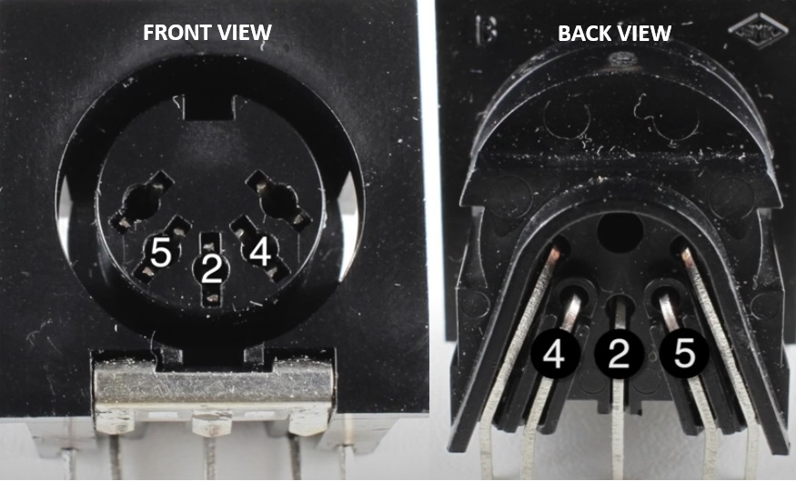

# sofie-midi-controller
Simple and effective MIDI controller project designed to work with 8 push buttons, 8 LEDs, and an LCD1602 display. It communicates with MIDI-compatible devices by sending MIDI output messages.

> ⚠️ This project is currently under development.

## 🖼️ Pinout Diagram

## 🔧 Features

- MIDI channel switching  
- Volume and boost volume control via EC11W rotary encoder  
- Bank up/down navigation  
- Patch switching (A, B, C) to avoid stepping directly on your pedalboard  
- Delay and chorus toggling

## 🧰 Required Components

- 1x Arduino Uno  
- 8x Push buttons  
- 8x LEDs  
- Some 220Ω resistors  
- 1x LCD1602 I2C Display  
- 1x EC11W Rotary Encoder  

## 📺 Reference Material

This project is based on and inspired by the following video tutorial from Notes and Volts YouTube channel:  
[Watch on YouTube](https://www.youtube.com/watch?v=XXXXXXXXXXXXXXXX)

## 📌 Notes

- MIDI output is implemented using the Arduino's serial interface.
- The project uses standard MIDI messages and can be easily adapted to control different gear.
- Future updates will include support for additional effects and extended patch banks.

## 💬 Contributing

Feel free to fork the repository and open pull requests to improve or expand the project. Suggestions and contributions are always welcome!
